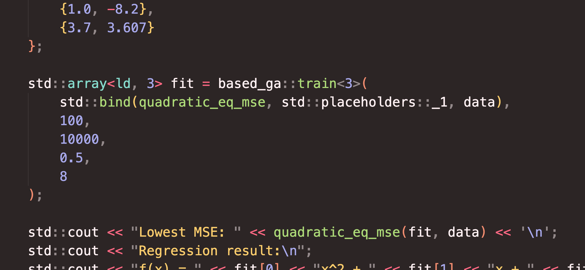

# Based GA
High performance (multithreaded) and lightweight genetic algorithm implementation.



## Installation
Copy `based_ga.hpp` into your source or your compiler's include path.

## Usage
**One function. It's that simple.**
```cpp
template <std::size_t param_c>
std::array<long double, param_c> based_ga::train(
    std::function<ld(const std::array<long double, param_c>&)> eval,
    unsigned long long gen_c,
    unsigned long long child_c,
    long double var,
    unsigned long long thread_c = 1
);
```
**`based_ga::train`**: Returns optimal parameters for a function `eval`.
- **`param_c`** - Parameter count for the target function. Needed because `std::array` size must be known at compile time.
- **`eval`** - `std::function` object for the target function. Must take in `const std::array<long double, std::size_t>&` and return `long double`. **Note that `based_ga::train` MINIMIZES this return value.**
- **`gen_c`** - No. of generations.
- **`child_c`** - No. of children/generation.
- **`var`** - Maximum variance when mutating child "genes".
- **`thread_c`** - Number of threads to use. Defaults to `1`.

## Why `inline` and no separate header/implementation?
This is not possible with template functions, and common workarounds do not work well with my needs. Besides, it is not likely that this project's functions will be used on several occasions, so `inline` is completely fine.

## Why is it based?
I did not implement crossing over. (No sexual reproduction)
